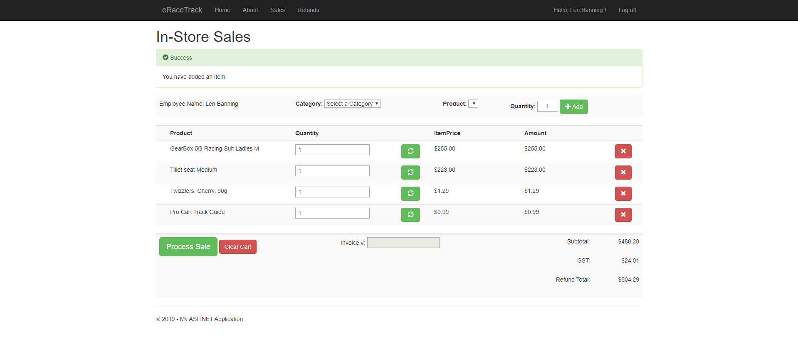
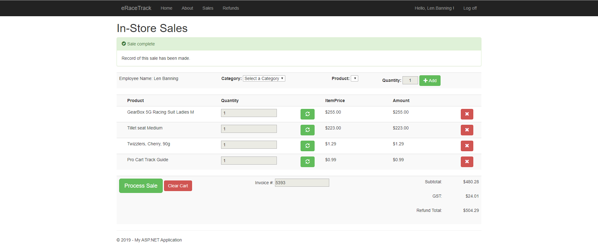
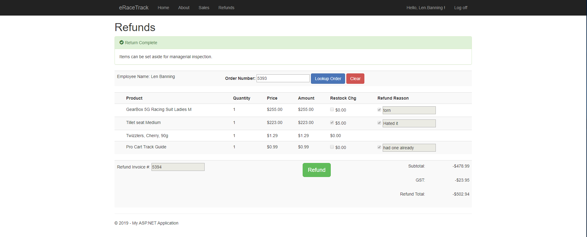

# eRace Sales System

This site allows a user to create a sales record in the database into the required tables. The site also allows the user to create a refund record.

## Adding a Sales cart item 

- User selects a category
- User selects a product from that category, adds quantity, and presses add button to add to cart.

## Completing Sale

 - User clicks process sale
 - Code-behind goes through the GridView gathering all required data and creates a new invoice and invoice details record. The quantity on-hand in the products table is adjusted to reflect the new amount on hand.

 ## Refund 

 

 - User looks up original invoice ID.
 - System populates GridView with details.
 - `**Note: Confectionary items cannot be returned; therefore, the restock charge field and return reason fields are uneditable.**`
 - User clicks refund button, code-behind goes through and gathers required information. 
 - System creates new invoice, invoice details, and a refund record for each refunded item.
 - System updates quantity on-hand.
